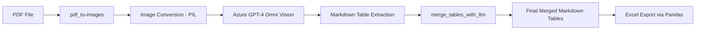

## 📄 PDF/Image Table Extractor using Azure GPT-4 Omni (AFR)

This project extracts tables from **image-based PDFs** using **Azure OpenAI's GPT-4 Omni** model. The tables are identified from PDF pages as images and converted to **Markdown format**, then intelligently **merged** and saved into **Excel files**.

---

## 🚀 Features

- 📄 Convert PDF pages into images
- 🤖 Use Azure GPT-4 Omni Vision to extract **Markdown-formatted tables**
- 🧠 Merge multi-page tables intelligently (preserve headers, structure, etc.)
- 📦 Export final output as **Excel sheets**
- 🌐 Async processing for improved speed (parallel LLM requests)

---
## 🧠 Architecture Overview


---
## 🧰 Tech Stack

- `Python 3.8+`
- `Azure OpenAI GPT-4 Omni`
- `fitz` (PyMuPDF) for PDF image extraction
- `PIL` for image manipulation
- `pandas` for Excel generation
- `litellm` to interact with Azure LLM APIs
- `asyncio` for concurrent processing

---

## 📦 Installation

### 1. Clone the Repository

```bash
git clone https://github.com/YogiHalagunaki/Data-Science-GenAI-Solutions.git
cd AFR_using_LLM
```
### 2. Set Up Virtual Environment
```bash 
python3 -m venv venv
source venv/bin/activate
```
### 3. Install Dependencies
```bash 
pip install -r requirements.txt

Note : If requirements.txt is missing:

pip install pymupdf pillow pandas openai litellm python-dotenv xlsxwriter
```
## Environment Setup
```env
AZURE_API_KEY=your-azure-openai-api-key
AZURE_API_BASE=https://your-resource-name.openai.azure.com/
AZURE_API_VERSION=2024-02-15-preview
```
---

## 📂 Folder Structure
```bash 
.
├── pdf_image_table_extraction.py                        # Main runner script
├── output/
│   └── <pdf_name>/
│       ├── tables_extracted.json
│       └── merged_tables.xlsx
├── .env
├── README.md
└── requirements.txt
```
---

## ▶️ Usage

### Set PDF path and Run the script:
```bash 
pdf_path = "/path/to/your/document.pdf" # set the path in the below script 
python pdf_image_table_extraction.py
```
### 🗃 Sample Output (Markdown → Excel)
```markdown
| Date       | Description    | Amount  |
|------------|----------------|---------|
| 2023-01-01 | Item A         | $10.00  |
| 2023-01-02 | Item B         | $15.00  |
```

---

## 🙋 Author

**Yogi Halagunaki**  
GitHub: [@YogiHalagunaki](https://github.com/YogiHalagunaki)  
Email: halagunakiyogi@gmil.com  
Location: India 

