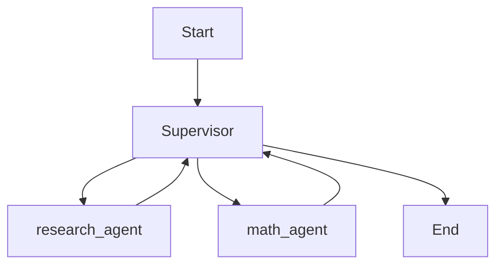

# 🤖 LangGraph Supervisor: Multi-Agent Reasoning with Azure GPT-4 Omni

This project demonstrates how to use **LangGraph**, **Azure GPT-4 Omni**, and a **Supervisor agent** to coordinate multiple specialized agents: one for math, and one for research. The system can intelligently route user queries to the appropriate expert agent.

---

## 📌 Overview

This example builds a multi-agent system using:

- 🧠 **Math Expert Agent** – Handles mathematical computations
- 🌐 **Research Expert Agent** – Performs web-like lookups (mocked in this example)
- 🧭 **Supervisor Agent** – Orchestrates task delegation and decision-making

Powered by **Azure OpenAI GPT-4 Omni** and **LangGraph's agentic workflow framework**.

---

## ⚙️ Multi-Agent Supervisor Workflow

---
## 🔧 Tech Stack

| Component        | Description                                     |
|------------------|-------------------------------------------------|
| `LangGraph`      | Graph-based agent orchestration framework       |
| `langgraph_supervisor` | Supervisor wrapper for multi-agent control |
| `LangChain`      | LLMs and tool integration layer                 |
| `Azure OpenAI`   | GPT-4 Omni model for reasoning and execution    |
| `Python`         | Core programming language                       |

---

## 📦 Installation

### 1. Clone the Repository

```bash
git lone https://github.com/YogiHalagunaki/Data-Science-GenAI-Solutions.git
cd Agentic AI Applications
```
### 2. Create and Activate Virtual Environment
```bash 
python3 -m venv venv
source venv/bin/activate
```
### 3. Install Dependencies
```bash 
pip install langchain langgraph openai langchain-openai python-dotenv
```
### 4. Running the App
```bash 
Note :  "content": "what's the combined headcount of the TCS companies in 2024?"

python langraph_supervisor.py
```

## 🙋 Author

**Yogi Halagunaki**  
GitHub: [@YogiHalagunaki](https://github.com/YogiHalagunaki)  
Email: halagunakiyogi@gmil.com  
Location: India 
