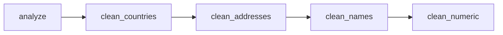

# Data Cleaning Agent

A modular and extensible Python-based agent for intelligent **data cleaning**, **normalization**, and **preprocessing** of messy tabular data using custom logic and LLM-enhanced pipelines.

---

## 🚀 Features

- ✅ Automatic column type classification (`country`, `name`, `numeric`, `address`)
- 🌍 Standardizes country names to ISO 3-letter codes (e.g., "USA" → "USA")
- 👤 Cleans and formats names (removes titles, trims whitespace, proper casing)
- 🔢 Removes outliers from numeric columns using z-score
- 🏢 Normalizes address formats with common replacements (e.g., "St." → "Street")
- 📅 Flexible handling of inconsistent date formats (extendable)
- 🤖 LLM-ready architecture via Azure OpenAI and `LangGraph` workflow engine
- 📦 Easy CSV or Excel I/O

---

## 📁 Project Structure

```bash
.
├── example_usage.py # Test script for loading and cleaning sample data
├── data_cleaning_agent.py# Core logic for data cleaning agent
├── .env # Environment variables for Azure OpenAI
├── cleaned_data.csv # Output file with cleaned data
└── README.md # This file


```
---

## 🧠 How It Works

### 1. `DataCleaningAgent` Class
Handles the complete cleaning workflow including:

- Column classification
- Country normalization using `pycountry` + `fuzzywuzzy`
- Name/address normalization
- Numeric outlier detection with `scipy.stats.zscore`

### 2. LangGraph Workflow

The cleaning process is defined as a directed graph:


---
## 🛠️ Setup Instructions

### 1. Clone the Repository
```bash 
# Clone the repo
git lone https://github.com/YogiHalagunaki/Data-Science-GenAI-Solutions.git
cd Data Analysis Agent


```
### 2. Install dependencies
```bash 
pip install -r requirements.txt

```
### 3. Configure Environment Variables
```bash
AZURE_OPENAI_API_KEY=your_key_here
AZURE_OPENAI_ENDPOINT=https://your-endpoint.openai.azure.com/
AZURE_OPENAI_API_VERSION=2024-XX-XX

```
### 4. Run the Sample Cleaning Script
```bash
python example_usage.py

```
## 🧪 Sample Output
```plaintext
Starting data cleaning process...
responce::::::::: Identified country column: location
responce::::::::: Identified name column: full_name
responce::::::::: Identified numeric column: age
responce::::::::: Identified numeric column: salary
responce::::::::: Normalized country names in column: location
responce::::::::: Normalized names in column: full_name
responce::::::::: Removed outliers from column: age
responce::::::::: Removed outliers from column: salary

```
---
## 🧩 Extensibility
* You can extend the agent by:

* Adding custom logic to _normalize_* methods

* Adding new node functions and updating create_workflow()

* Integrating LLM-based decisions (currently scaffolded for Azure OpenAI)

--- 

## 🙌 Acknowledgments
Built with:

- `LangGraph`

- `Azure OpenAI`

- `pandas`

- `scipy`

- `fuzzywuzzy`

```

## 🙋 Author

**Yogi Halagunaki**  
GitHub: [@YogiHalagunaki](https://github.com/YogiHalagunaki)  
Email: halagunakiyogi@gmil.com  
Location: India 

